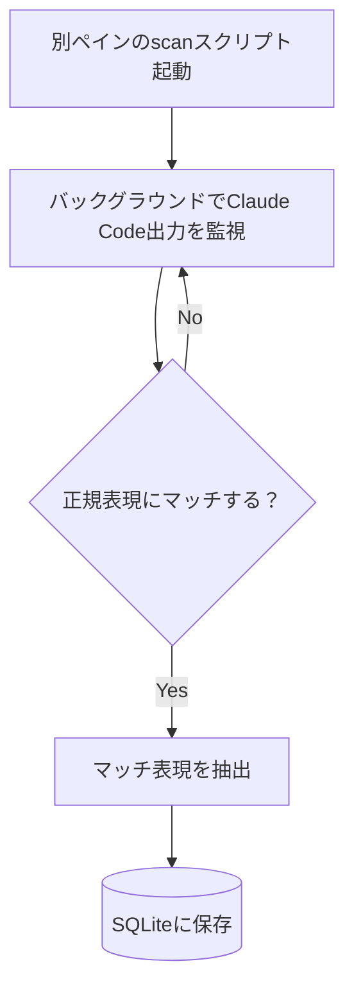

Claude Code 使ってると、`✢ なんたらing…` ってよく見ますよね。

_急にキャラメリゼしだすClaude Code氏_

こいつらをコレクションしてみたい...。

というわけで、 `なんたらing`（フレーバーテキストって言うらしい） をコレクションするツール `cc-flavors` を作りました。

https://github.com/takymt/cc-flavors

## 動かしてみよう

実際に動かしてみるとこんな感じです

_今まで出会ったフレーバーテキストをカウントできる_

構成はちょっと力技ですが、

という構成になっています。

（本当は環境汎用で作りたかったのですが、Claude Code出力のキャプチャが思ったよりも面倒だったため、tmuxペインをキャプチャする構成になっています）

## 見返せる楽しさ

見返していると、結構面白い単語を発見できたりします。

- `Wizarding`: 「ウィザード(魔法使い)してる」みたいな感じでしょうか。魔法のようにコードを生成しているという傲慢なアピールです。
- `Sparkling`: 日本語に訳すと「煌めき中」です。勝手に煌めくなよ。
- `Moonwalking`: ハルシネーションを、進んでいるように見せかけて後退しているムーンウォークに例えているのはセンスありますね。
- `Mulling`: 「熟考する」みたいな意味らしいです。「無理んぐ」感すごい。

出力中の一瞬の間にこんな考察するのはなかなか難しいですが、保存さえしておけば後から見返して楽しむことができます。

## 免責ing…

ふとした楽しみを与えてくれる `cc-flavors` ですが、以下の制約があります

- 現状tmux環境でのみ動作する
- `spinnerVerbs` 設定がデフォルト状態のユーザを想定している
- `DISABLE_NON_ESSENTIAL_MODEL_CALLS` が `false` なユーザを想定している

実態はただの正規表現マッチャーなので、 `spinnerVerbs` 設定含むマッチした任意のテキストを保存するのですが、そこは紳士協定/純粋な心で楽しんでいただければと思います。

## 締め

以上、Claude Code のフレーバーテキストコレクションツール `cc-flavors` の紹介でした。非tmuxユーザやptyに詳しい方など、各位コントリビュートお待ちしております！

ちなみに僕の好きなドーナツは `✢ ポンデリing…` です (やかましい)
