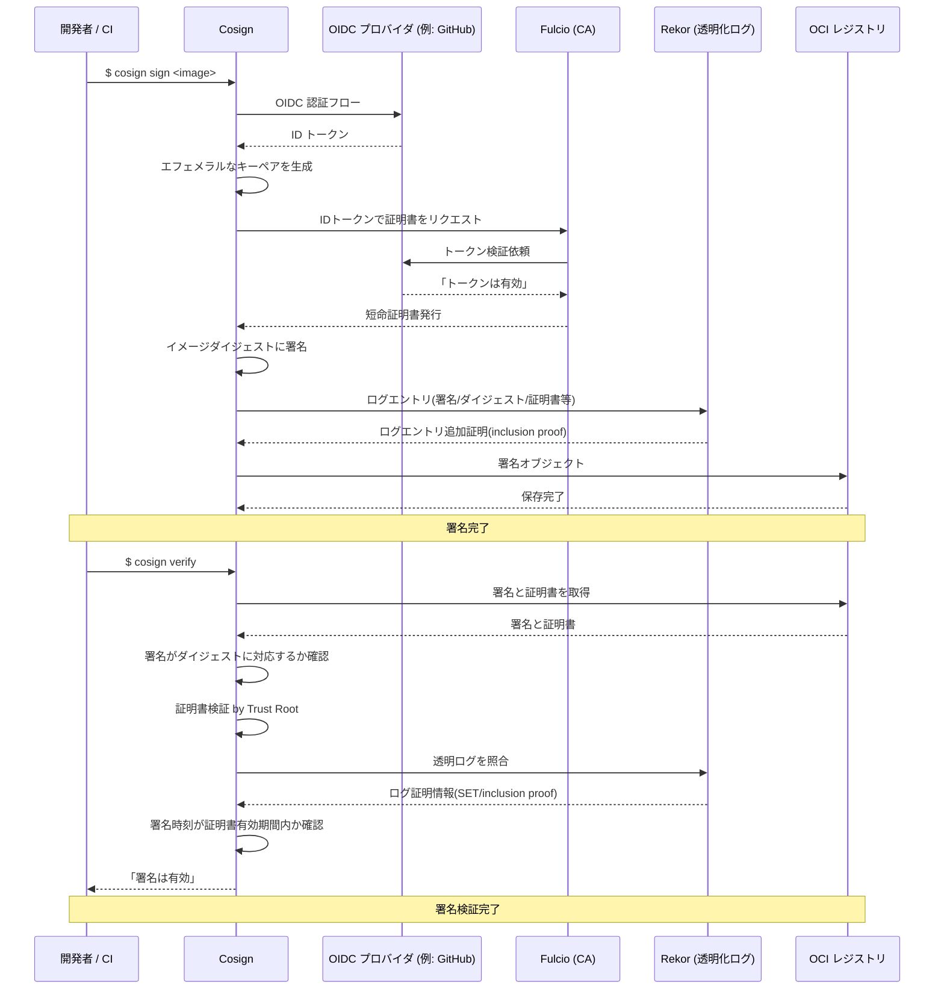

## なんの話？

ソフトウェアのアーティファクトにおける「署名」の話

- その成果物が本当に開発者によるものか？
- 改ざんされていないか？
- いつ誰が署名したか？

これらを検証可能にするために、従来は [GPG](https://www.gnupg.org/) を用いる手法が主流でした。
近年は Cosign という Keyless で コンテナフレンドリーな手法が台頭してきているようです。

https://github.com/sigstore/cosign

## GPGの課題

GPG は [OpenPGP](https://www.rfc-editor.org/rfc/rfc9580.html) 互換のオープンソース実装であり、 PGP の鍵モデルに依存します。^[[The GNU Privacy Guard](https://www.gnupg.org/)]
ここからは PGP 方式の既知の課題を挙げていきます。なんとなく知ってる方はスキップで OK。

### 長期鍵管理モデルの構造的な問題

PGP の鍵モデルには以下の特徴があり、「長く使うほど信頼が増える」構造になっています。

- 事実上永久のルート鍵を自身のアイデンティティとして保管する
- 分散信頼システムである `Web of Trust (信頼の輪)` に基づいており、他の誰かに署名されることでアイデンティティの信頼を積み上げる

しかしながら、当然クレデンシャルには常に漏洩の可能性があります。そして、長く使えば使うほど、その可能性は高まります。たとえ [Yubikey](https://www.yubico.com/yubikey/?lang=ja) のような PGP 鍵管理ツールを使用していたとしても、絶対に漏洩しない保証はありません。当時 PGP コミュニティに所属していた [Fillipo Valsorda](https://filippo.io/) ですら、この構造的問題を内部から痛烈に批判しています。 ^[[I'm giving up on PGP](https://words.filippo.io/giving-up-on-long-term-pgp/)]

> But the real issues I realized are more subtle. I never felt confident in the security of my long term keys. The more time passed, the more I would feel uneasy about any specific key.

他にも Python エコシステムの例では、[PEP-761](https://peps.python.org/pep-0761/) で Python アーティファクトの署名に PGP 署名を使用しないようにする仕様が規定されており、リリース管理者が7年以上もの間秘密鍵を保有しつづけるのは不適当だとしています。

> Requiring release managers to maintain and protect PGP private keys for seven or more years is an unnecessary burden in the new age of ergonomic and ephemeral signing keys.

### 前方秘匿性の不足

今日の暗号モデルでは、大抵セッション鍵を用いた[前方秘匿性(Forward Secrecy)](https://ja.wikipedia.org/wiki/Forward_secrecy)が前提となっています。
前方秘匿性とは「仮に秘密鍵が侵害されても過去の内容は復元できない」性質のことで、 TLS などで用いられる[楕円 Diffie–Hellman 鍵交換](https://en.wikipedia.org/wiki/Elliptic-curve_Diffie%E2%80%93Hellman)がその代表例です。

しかしながら PGP の仕様にこの性質は規定されていません。つまり一度長期鍵が漏洩してしまえば、過去の暗号化内容が全て復号できてしまうことになります。
もちろん PGP ツールでも、セッション鍵と長期鍵を使い分けることで前方秘匿性を模倣することはできますが、実際にそこまでやるユーザはほとんどいないことが指摘されています ^[[The PGP problem - No Foward Secrecy](https://www.latacora.com/blog/2019/07/16/the-pgp-problem/#no-forward-secrecy)]

### 信頼の輪 (Web of Trust) が機能しない

PGP 仕様は 信頼の輪 (Web of Trust) に基づいた分散信頼システムですが、実際には

- 鍵を信頼すべきかどうかの正確な判断は専門家でも難しいため、結局多くのユーザが中央集権的な権威を信頼の基準にしている^[[The PGP problem - Incoherent Identity](https://www.latacora.com/blog/2019/07/16/the-pgp-problem/#incoherent-identity)]
- そもそも署名してくれる人が少ない( Fillipo Valsorda の場合は年2回程度) ^[[I'm giving up on PGP](https://words.filippo.io/giving-up-on-long-term-pgp/)]

といった課題があり、見せかけの分散システムだと批判されることがあるようです。

### コンテナや CI との相性が悪い

コンテナや CI といった実行主体は短命であるため、PGP モデルの「永続化された人間のためのアイデンティティ」という思想と本質的に相容れません。

いくら GitHub のシークレット管理が堅牢といっても、長期秘密鍵をクラウド上で管理/ローテーションするコストやリスクを負うことに変わりはありません。

## Cosignが解決すること

Cosign はこれらの PGP における課題を直接的/間接的に解消することができます

- **キーレス(Keyless)署名**: OIDC認証＋短命証明書で都度署名が可能（秘密鍵の長期保管不要）
- **ログ公開による透明化**: 署名をログ台帳に記録し、不正署名や改ざんを検知
- **コンテナ/CIフレンドリー**: 一時的な実行環境での自動署名が可能（CIでの鍵管理不要）

## Cosignの仕組み

[Tooling](https://docs.sigstore.dev/about/tooling/)

[Security Model](https://docs.sigstore.dev/about/security/)

### Keyless署名/検証フロー

### Trust Root

- 多様な企業/学術団体から選ばれた 5 名の鍵管理者の総称
- Fulcio の証明書や Rekor のログエントリを、Trust Root を使って検証可能

### Fulcio（CA）

- Cosign CLI が生成したキーペアに対し短命な X.509 証明書を発行する CA
- CA 証明書は Trust Root によって署名されている
- CA 証明書はログとして公開されるため、ユーザはログにある証明書のみを信頼できる

### Rekor（ログ基盤）

- 署名/イメージダイジェスト/証明書を含むログエントリを保存
- 追記専用(append-only)、改ざん不可(=Merkle Inclusion Proof)
- ログエントリは Trust Root によって署名されている

#### Merkle Inclusion Proof

_[Wikipedia - Merkle Tree](https://en.wikipedia.org/wiki/Merkle_tree)_

- [ブロックチェーン技術としても知られる Merkle Tree](https://bitcoin.org/files/bitcoin-paper/bitcoin_jp.pdf) を活用したログ改ざん検知
- 子ノードのハッシュをまとめて親ノードのハッシュが作られる
- 表 `hash(L1)`, `hash(L2)`, `hash(L3)`, `L4` が与えられたとき、計算によって得られる Top Hash と実際の Top Hash が一致していれば `hash(L4)` が木構造に含まれていることがわかる (= Merkle Inclusion Proof)
- Rekorの場合は、 Rekor がログエントリ自身とそれ以外のハッシュ値を返却することで、実際にログが保存されたかを検証できる

## Cosignの課題

そんなモダンで CI フレンドリーな署名モデルの Cosign ですが、

- 中央集権への回帰
  - PGP のメリットであった分散性を失い、 Sigstore のエコシステムに依存することになる
- ユーザ負荷の高い運用
  - 主要コンポーネントを制御するための理解コストを払う必要がある
  - ログ監視を自前で回さないと不正発行の検知が遅れる
- git のタグやコミットへの署名など、GPG/SSH でしか依然対応できない領域もある

といった側面もあるでしょう。

とはいえCI/コンテナ周辺においては、既存PGPエコシステムの課題と天秤にかけるほどではないのかもしれません。

## 終わりに

自作アプリ開発の過程で気になった、Cosign 署名モデルについてざっくり調べてみました。

個人的には、何でこんな自然に思えるモデルが今までなかったんだろうという疑問を抱きました (k8s や CICD の台頭とか、インフラ発展とか、色々あるのかな)

ともかく、GPG 限らずキーペアの管理には前々から嫌気が差していたので、今後もお世話になるんだろうなと思います。

ありがとう sigstore、ありがとう CNCF...！
